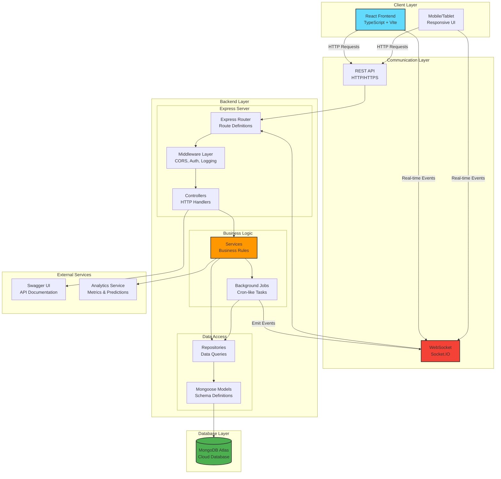
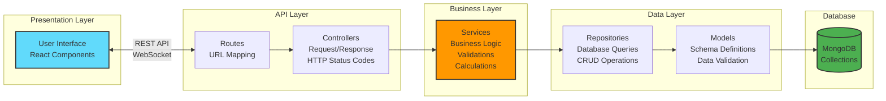
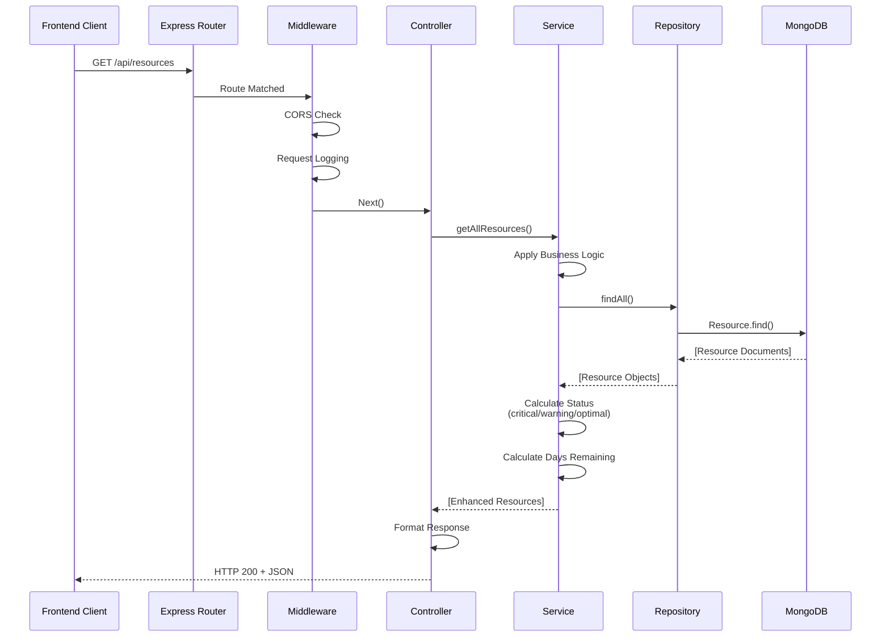
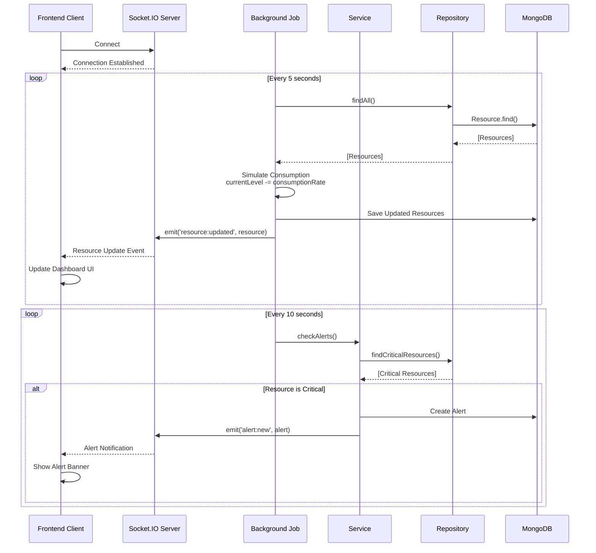
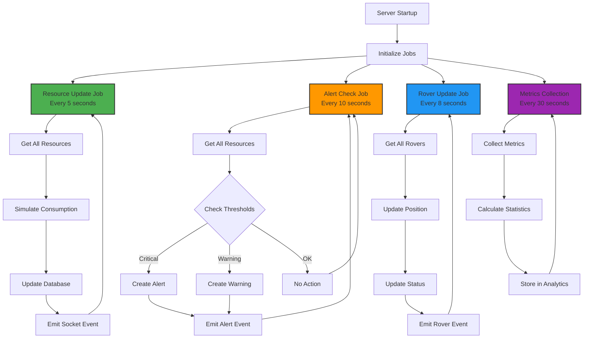
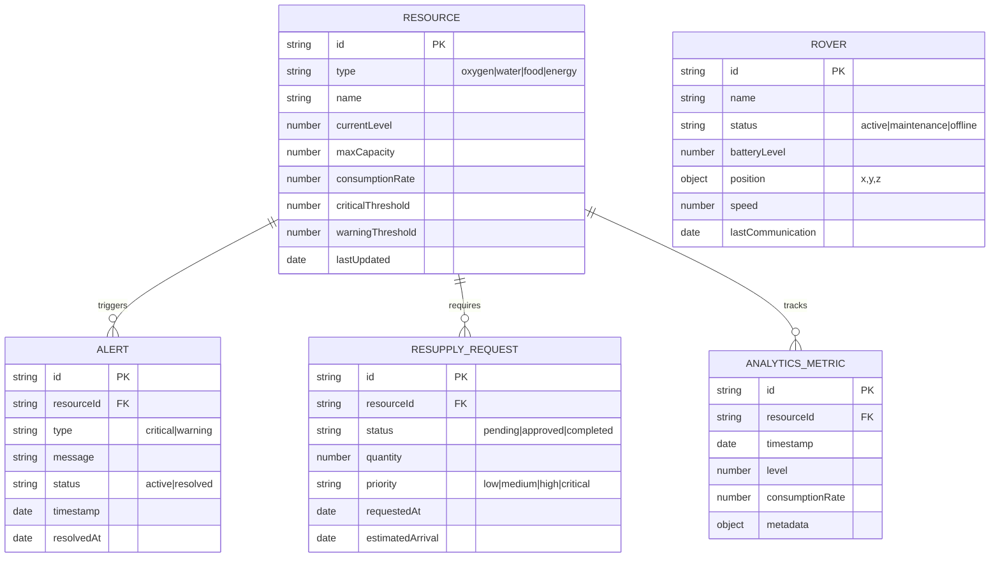
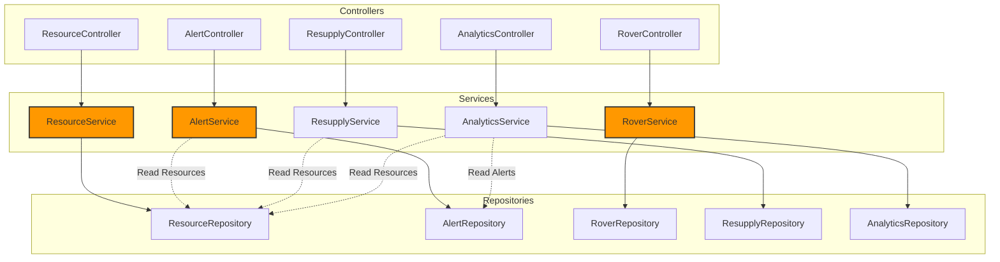
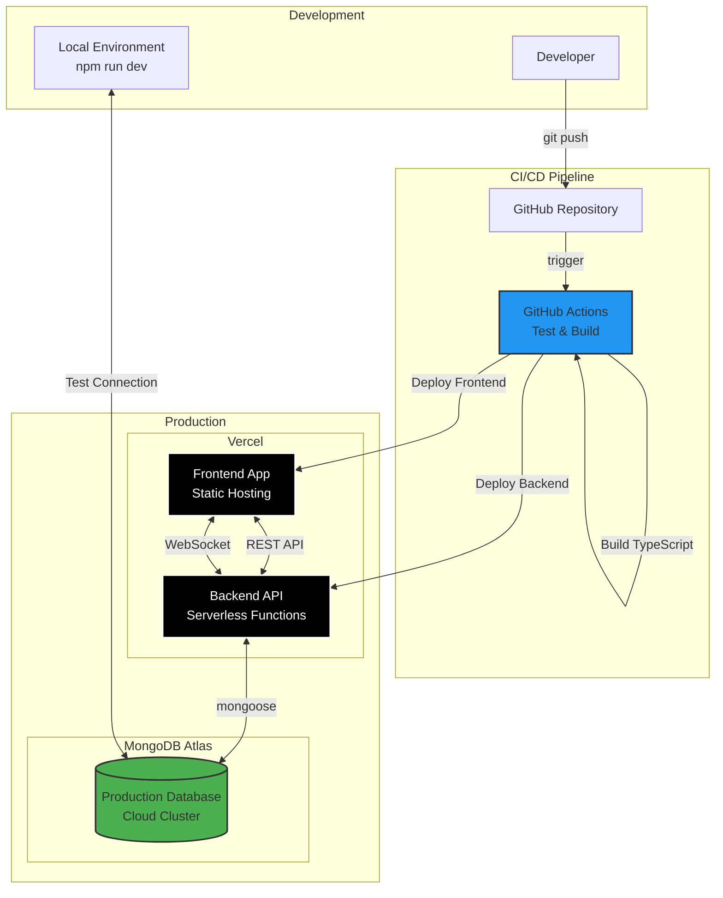
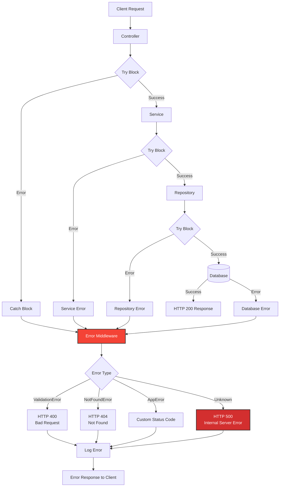

# Mars Resource Management System - Architecture

## System Architecture Overview

## Layered Architecture

## Request Flow (HTTP)

## Real-time Updates (WebSocket)

## Background Jobs System

## Database Schema

## Service Dependencies

## Deployment Architecture

## Error Handling Flow

