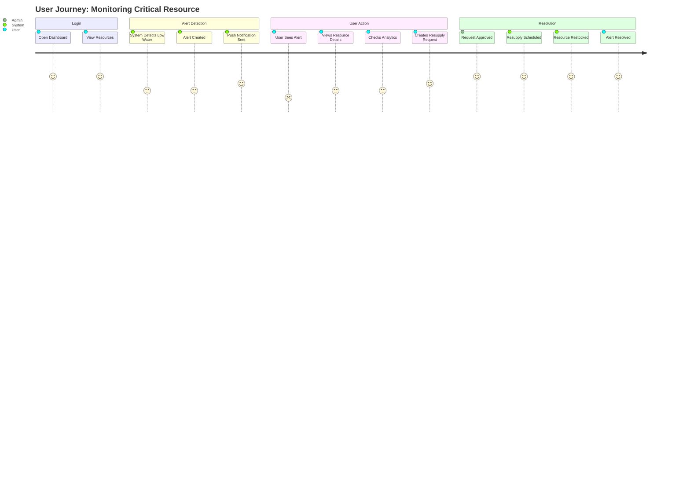
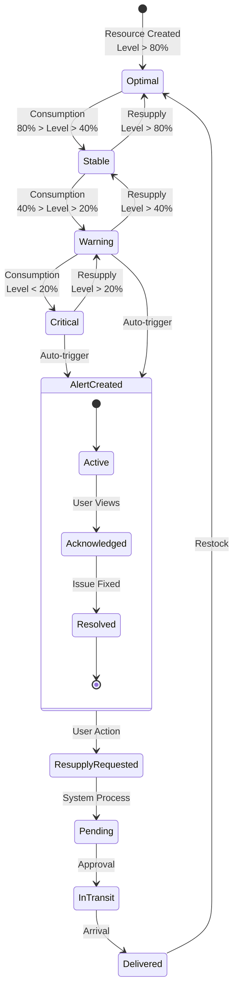
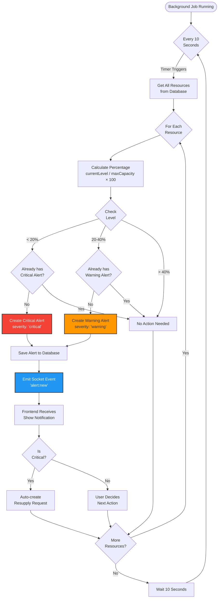
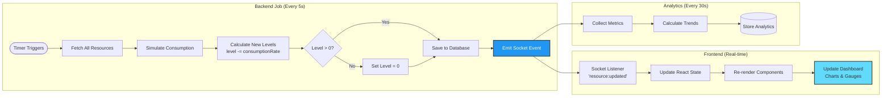
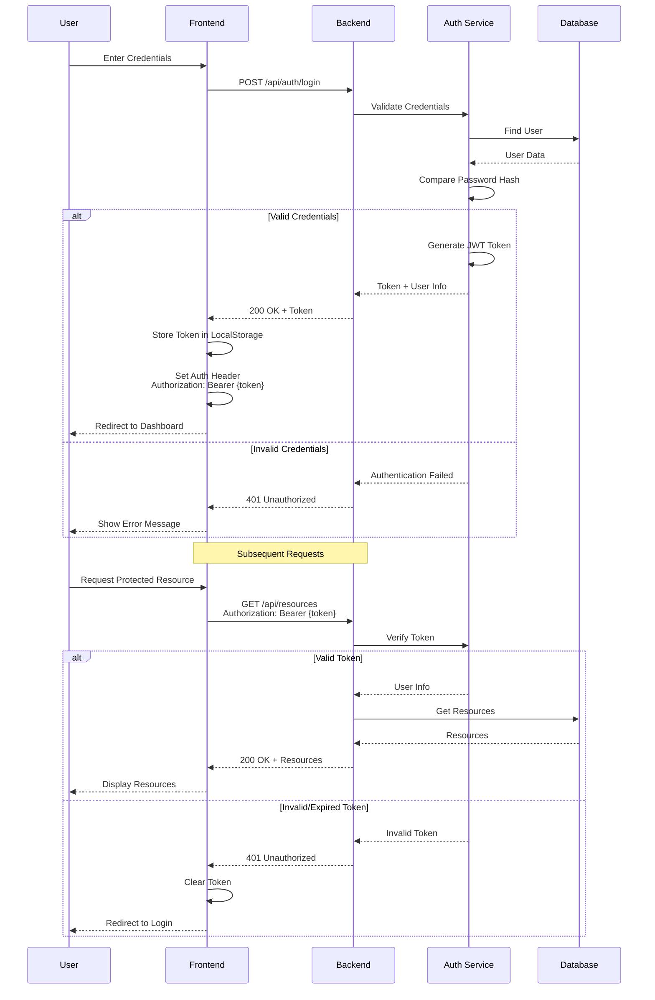
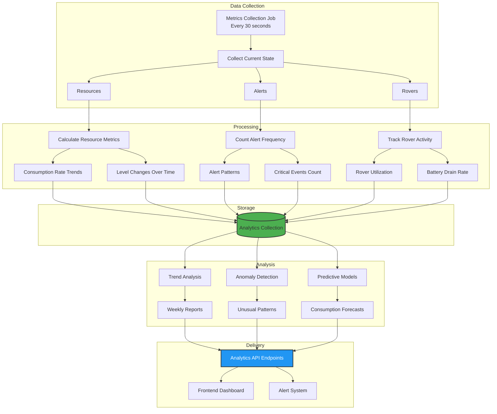
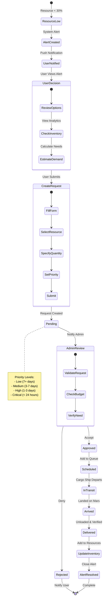
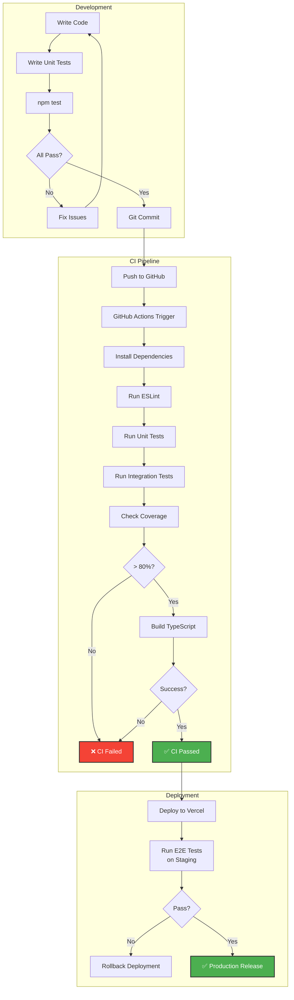

# Mars Resource Management System - Data Flow

## Complete User Journey: Resource Monitoring

## State Machine: Resource Lifecycle

## Alert System Flow

## Resource Update Cycle

## CRUD Operations Flow

```mermaid
graph TB
    subgraph "CREATE"
        C1[POST /api/resources] --> C2[Validate Request Body]
        C2 --> C3[Service.create]
        C3 --> C4[Repository.create]
        C4 --> C5[Model.create]
        C5 --> C6[(Insert into MongoDB)]
        C6 --> C7[Return Created Resource]
        C7 --> C8[HTTP 201 Created]
    end

    subgraph "READ"
        R1[GET /api/resources/:id] --> R2[Extract ID from params]
        R2 --> R3[Service.getById]
        R3 --> R4[Repository.findById]
        R4 --> R5[Model.findById]
        R5 --> R6[(Query MongoDB)]
        R6 --> R7{Found?}
        R7 -->|Yes| R8[Return Resource]
        R7 -->|No| R9[Throw NotFoundError]
        R8 --> R10[HTTP 200 OK]
        R9 --> R11[HTTP 404 Not Found]
    end

    subgraph "UPDATE"
        U1[PUT /api/resources/:id] --> U2[Validate Request Body]
        U2 --> U3[Service.update]
        U3 --> U4[Repository.update]
        U4 --> U5[Model.findByIdAndUpdate]
        U5 --> U6[(Update in MongoDB)]
        U6 --> U7[Return Updated Resource]
        U7 --> U8[Emit Socket Event<br/>'resource:updated']
        U8 --> U9[HTTP 200 OK]
    end

    subgraph "DELETE"
        D1[DELETE /api/resources/:id] --> D2[Extract ID]
        D2 --> D3[Service.delete]
        D3 --> D4[Repository.delete]
        D4 --> D5[Model.findByIdAndDelete]
        D5 --> D6[(Delete from MongoDB)]
        D6 --> D7[Return Success]
        D7 --> D8[HTTP 204 No Content]
    end

    style C8 fill:#4caf50,stroke:#333,stroke-width:2px,color:#fff
    style R10 fill:#2196f3,stroke:#333,stroke-width:2px,color:#fff
    style U9 fill:#ff9800,stroke:#333,stroke-width:2px
    style D8 fill:#f44336,stroke:#333,stroke-width:2px,color:#fff
```

## Authentication & Authorization Flow (Future)

## Analytics Data Pipeline

## Resupply Request Workflow

## Testing Strategy Flow

